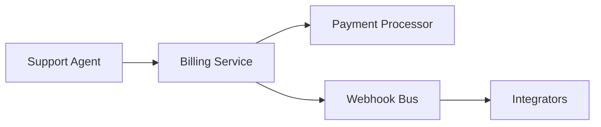
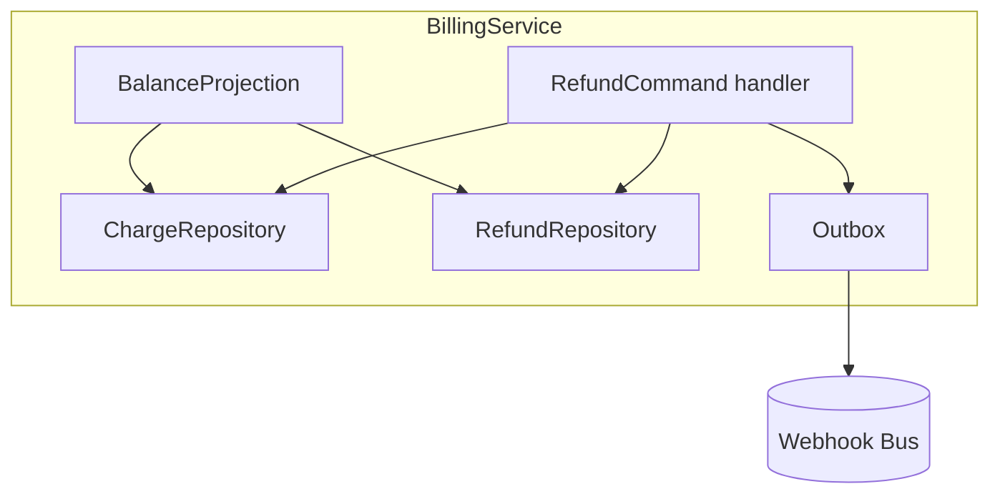

# 02 — End-to-end single change: `billing/2026-05-19-add-refunds`

**Audience.** A tech lead shipping a real change through the full
pipeline.

**Setting.** Marcus owns billing at a B2B SaaS. The team needs to
support partial refunds on the `subscriptions` capability. The
billing wiki already exists (one previously-archived change
introduced invoicing concepts), and there is a `billing` bounded
context. No change is currently in flight.

Repo state at the start:

```
raw/
wiki/
├── index.md
├── log.md
├── concepts/         (14 pages — invoicing, dunning, …)
├── entities/         ( 6 pages)
├── contexts/billing.md
├── context-maps/billing-to-identity.md
├── decisions/        (3 ADRs from prior change; all accepted)
├── specs/            (4 mirrored specs from prior change)
├── summaries/        (8)
└── syntheses/        (1, archived)
development/
├── config.yaml
├── log.md
└── manifests/billing/archive/2026-02-04-invoice-pdfs/
openspec/
├── config.yaml
├── schemas/
├── changes/          (empty — last change archived)
└── archive/2026-02-04-invoice-pdfs/
```

`development/config.yaml` (excerpt):

```yaml
scientia_schema_version: 1
verify:
  block_on_severity: warning
hermes:
  kanban_db: ~/.hermes/kanban.db
tenants:
  billing:
    reviewer_quorum: 1
```

## Phase 1 — Wiki: grill, lint, bind

```
> "Use the scientia skill."
```

```
scientia (orchestrator):
  state:
    tenants: {} (no in-flight)
    last_archive: billing/2026-02-04-invoice-pdfs
  recommended next: name a tenant + change, then scientia-wiki-grill
```

```
> "I want to start a change on the billing tenant: add partial
   refunds to subscriptions. Goal is to let support agents refund a
   specific charge, partially or fully, without canceling the
   subscription. Out of scope: refunds across multiple invoices in
   one operation."
```

The orchestrator records the intent and delegates to
`scientia-wiki-grill`.

### 1.1 — `scientia-wiki-grill`

The grill walks the in-scope subset of the wiki (the `billing`
context page, its `## In-Scope Concepts`, the
`billing-to-identity` context map, the three in-force ADRs) looking
for gaps. It surfaces four:

1. The context's `## Ubiquitous Language` glossary has no entry for
   *"refund."* The grill recommends adding one and proposes a
   definition. Marcus accepts and refines: *"A reversal of a charge
   that adjusts the subscriber's balance but does not alter the
   subscription's billing schedule. Partial refunds are valid; refund
   amount ≤ original charge."*
2. `[[concepts/charge]]` has confidence `medium`; the grill asks one
   question to elevate it to `high` (whether voided-during-capture
   counts as a charge). Marcus answers: no.
3. There is no concept page for *"refundable window."* The grill
   recommends creating one with a 90-day window default citing the
   prior payment-processor ADR. Marcus accepts.
4. `[[decisions/ADR-0003-idempotent-invoice-numbers]]` is `accepted`
   and touches the change scope. The grill confirms the change does
   not violate idempotency (refunds get their own ids; invoice
   numbers are untouched) and so no supersession is needed. Logged.

The skill edits the four wiki pages directly (it *is* allowed to
extend existing pages — that's the point of the grill). New page
`wiki/concepts/refundable-window.md` is created.

`scientia-wiki-grill` ends with a readiness report:

```
scientia-wiki-grill — readiness for billing/add-refunds:
  Pages touched: 4
    extended:  contexts/billing.md, concepts/charge.md
    created:   concepts/refundable-window.md
    annotated: decisions/ADR-0003-idempotent-invoice-numbers.md
  Open questions parked: 0
  Ready for: scientia-wiki-lint → scientia-wiki-bind
```

### 1.2 — `scientia-wiki-lint`

```
> "Lint."
```

```
scientia-wiki-lint:
  CRITICAL: 0
  WARNING:  0
  SUGGESTION: 1
    wiki/concepts/refundable-window.md — only one source; consider
    cross-referencing concepts/dunning when the dunning interaction
    becomes relevant.
```

Clean. Marcus commits the wiki edits before binding (the bind gate
will reject an uncommitted wiki).

```bash
$ git add wiki/ && git commit -q -m "wiki: grill refunds-add change"
```

### 1.3 — `scientia-wiki-bind`

```
> "Bind."
```

`scientia-wiki-bind` runs:

- `git rev-parse HEAD` → `9f3a1c2…` (the snapshot pin).
- Reads `wiki/contexts/billing.md`, pulls slices 1–4 and 7.
- Writes `development/manifests/billing/2026-05-19-add-refunds/core.md`.
- Creates the empty `openspec/changes/billing-2026-05-19-add-refunds/`.

`core.md` (excerpt):

```markdown
---
title: "Core manifest — billing/2026-05-19-add-refunds"
type: manifest-core
tenant: billing
change_id: 2026-05-19-add-refunds
description: "Allow support agents to refund a specific charge,
  partially or fully, without canceling the subscription."
capabilities: [refunds]
scientia_schema: 1
wiki_snapshot: 9f3a1c2dceb84e1f4f7d2a0bc8e7f59023117a6b
bundle_version: 0.1.0
created: 2026-05-19
---

## 1 — Domain Framing
billing is a *core* subdomain. Boundary: …

## 2 — In-Scope Concepts
- **[[concepts/charge]]** — A money movement against a subscriber's
  payment instrument.
- **[[concepts/refund]]** — A reversal of a charge that adjusts the
  subscriber's balance but does not alter the subscription's billing
  schedule.
- **[[concepts/refundable-window]]** — A duration after the original
  charge during which a refund may be initiated.
- ...

## 3 — In-Scope Entities
- **[[entities/payment-processor]]** — ...

## 4 — Ubiquitous Language
- **Charge** — ...
- **Refund** — ...
- **Refundable window** — ...
- **Settlement** — (false-cognate w/ identity: in billing means money
  has moved at the processor; in identity means a session-attestation
  state)

## 7 — Related Prior Work
- Invoice PDFs change (archived 2026-02-04) — established invoice
  immutability post-issue, ADR-0003.
```

Log line:

```markdown
- 2026-05-19T15:48:02Z — scientia-wiki-bind — manifest-bound — billing/2026-05-19-add-refunds — wiki_snapshot=9f3a1c2
```

Stage transitions from `absent` → `bound`.

## Phase 2 — Intent: proposal, spec, design, ADR, tasks, verify

### 2.1 — `scientia-intent-proposal`

```
> "Draft the proposal."
```

The skill reads `core.md`, then delegates to `scientia-grill` to
stress-test Marcus's intent. The grill asks five depth-first
questions:

- *"Is `refund-across-multiple-invoices` truly out of scope or
  just deferred?"* → out of scope; recorded.
- *"Does the change break the invariant that `subscriptions.balance`
  is monotone? Recommendation: yes — flag as **BREAKING** in
  proposal. Reasons: …"* → accepted, flagged.
- *"Is partial-refund a separate capability or part of `refunds`?"*
  → part of `refunds`; one capability.
- *"Are integrators (webhook consumers) affected? Recommendation:
  yes, new event type `refund.created`. Reasons: …"* → accepted.
- *"Should the change introduce a new ADR for the chosen refund-id
  scheme?"* → yes; recorded as a parked decision for the ADR stage.

`openspec/changes/billing-2026-05-19-add-refunds/proposal.md`:

```markdown
---
title: "Add partial refunds to subscriptions"
tenant: billing
change_id: 2026-05-19-add-refunds
manifest_core: development/manifests/billing/2026-05-19-add-refunds/core.md
created: 2026-05-19
---

# Proposal: Add partial refunds to subscriptions

## Why
Support spends an average of 11 minutes per refund ticket because the
current flow forces a cancel-and-rebill workaround. ...

## What Changes
- A support agent can refund a specific charge, partial or full.
- A new event `refund.created` is emitted on the webhook bus.
- **BREAKING:** `subscriptions.balance` is no longer monotone-non-
  decreasing. Consumers MUST tolerate decreasing balance.
- The dunning system reads refunds when computing past-due state.

## Out of Scope
- Refunding across multiple invoices in one operation.
- Refund reversal (un-refund).

## Capabilities Introduced or Modified
- `refunds` — issue and observe refunds against a single charge.

## Open Questions
- Refund id scheme (deferred to ADR stage).

## References
- Manifest core: development/manifests/billing/2026-05-19-add-refunds/core.md
- Relevant ADRs: [[decisions/ADR-0003-idempotent-invoice-numbers]]
- Related concepts: [[concepts/charge]], [[concepts/refund]], [[concepts/refundable-window]]
```

Log:

```markdown
- 2026-05-19T16:12:34Z — scientia-intent-proposal — proposal-drafted — billing/2026-05-19-add-refunds — capabilities=1 breaking=1
```

Marcus reviews, makes one tweak by hand to the *Why* (sharper
problem statement), and commits.

```bash
$ git add openspec/ && git commit -q -m "openspec: proposal — billing/2026-05-19-add-refunds"
```

Stage: `proposed`.

### 2.2 — `scientia-intent-spec`

```
> "Write the spec."
```

One capability (`refunds`) → one spec file at
`openspec/changes/billing-2026-05-19-add-refunds/specs/refunds/spec.md`.
The skill writes four scenarios; abbreviated:

```markdown
# Capability: Refunds

A support agent issues a refund against a specific charge, partial or
full, observing the resulting balance and event.

## Glossary (inlined from manifest)
- **Charge** — ...
- **Refund** — ...
- **Refundable window** — ...

## Personas
- **Support Agent** — authenticated employee with `billing:refund` scope.
- **Integrator** — external webhook consumer.

## Acceptance Criteria
- Full refund against a charge within the refundable window completes
  and emits exactly one `refund.created`.
- Partial refund (amount < charge total) is accepted and recorded.
- Refund against a charge outside the refundable window is rejected
  with `refund.expired`.
- Two concurrent refund attempts against the same charge result in at
  most one accepted refund.

## Scenarios

### Scenario: full refund within window
```gherkin
Given a Support Agent is authenticated with scope billing:refund
And a Charge of $50.00 was settled 30 days ago
When the Support Agent issues a refund of $50.00 against that charge
Then the refund is accepted with status "issued"
And a single refund.created event is emitted
```

### Scenario: partial refund within window
```gherkin
Given a Support Agent is authenticated with scope billing:refund
And a Charge of $50.00 was settled 30 days ago
When the Support Agent issues a refund of $20.00 against that charge
Then the refund is accepted with status "issued"
And the remaining refundable amount on the charge is $30.00
```

### Scenario: refund outside window rejected
```gherkin
Given a Support Agent is authenticated with scope billing:refund
And a Charge of $50.00 was settled 120 days ago
When the Support Agent issues a refund of $50.00 against that charge
Then the refund is rejected with code "refund.expired"
```

### Scenario: concurrent refund attempts deduplicate
```gherkin
Given a Charge of $50.00 was settled 5 days ago
And a Support Agent has already initiated a refund of $50.00 with key REF_K1
When a second refund of $50.00 with key REF_K1 is initiated
Then exactly one refund is accepted
And the duplicate is rejected with code "refund.duplicate_key"
```

## Kanban Tasks
<!-- Populated by scientia-kanban-emit on first emit. Do not hand-edit. -->
```

Also created: `wiki/specs/refunds.md` (mirror).

Stage: `specs`.

### 2.3 — `scientia-intent-design`

```
> "Design."
```

The skill computes the design-stage manifest extension
(`development/manifests/billing/2026-05-19-add-refunds/design.md` —
slices 5/6/8) and writes the design at
`openspec/changes/billing-2026-05-19-add-refunds/design.md`.

```markdown
# Design

## Overview
Refunds are modeled as a new aggregate `Refund` referencing a `Charge`
by id. The `subscriptions.balance` projection subscribes to a new
`refund.created` event in addition to the existing `charge.settled`. ...

## Context Diagram (C4 L1)


## Component Diagram (C4 L3)


## In-Force ADR Treatment
- **ADR-0003 — idempotent invoice numbers** — *Honored.* Refund ids
  use the same generator scheme adapted with prefix `REF_`. No
  conflict with invoice ids; supersession not needed.
- **ADR-0001 — subscription state machine** — *Honored.* Refunds do
  not transition subscription state.

## Architecturally Significant Requirements
- Idempotency on refund-creation by `idempotency_key`.
- Outbox-pattern delivery of `refund.created`.
- Concurrent-attempt deduplication (per acceptance criterion 4).

## Known Pitfalls Avoided
- Online/offline projection skew on `subscriptions.balance` —
  projection rebuild documented in the runbook.
- Settlement false-cognate with identity — namespaced in API:
  `billing.refund.*` events; never `settled` as a bare term.

## Open Questions
- (none)

## Decisions Distilled to ADRs
- Refund id scheme (`REF_<ksuid>`). Proposed ADR-0004.
- Webhook event versioning for `refund.created`. Proposed ADR-0005.
```

Log:

```markdown
- 2026-05-19T16:54:09Z — scientia-intent-design — design-drafted — billing/2026-05-19-add-refunds — adrs_in_force=2 open_questions=0
```

Stage: `design`.

### 2.4 — `scientia-intent-adr`

```
> "Write the ADRs."
```

Two ADRs (per the design's "Decisions Distilled to ADRs"):

- `openspec/changes/billing-2026-05-19-add-refunds/adr/ADR-0004-refund-id-scheme.md`
- `openspec/changes/billing-2026-05-19-add-refunds/adr/ADR-0005-refund-event-versioning.md`

Both are written as immutable Y-statements with all five clauses
(*In the context of … facing … we decided for … to achieve …
accepting …*). Status: `proposed` initially. The skill delegates
to `scientia-grill` once for the controversial clause (event
versioning — Marcus parks header-vs-payload as deferred).

Marcus reviews, marks both `accepted`, commits.

Stage: `adr`.

### 2.5 — `scientia-intent-tasks`

```
> "Write tasks."
```

`openspec/changes/billing-2026-05-19-add-refunds/tasks.md`:

```markdown
# Implementation Plan

## Capability: refunds
- [ ] **1.** Add `Refund` aggregate with id, charge_id, amount, status. — @spec: refunds#full-refund-within-window
- [ ] **2.** Implement `IssueRefund` command handler with idempotency-key dedup. — @spec: refunds#concurrent-refund-attempts-deduplicate (depends on #1)
- [ ] **3.** Validate refund amount ≤ remaining refundable on charge. — @spec: refunds#partial-refund-within-window (depends on #2)
- [ ] **4.** Reject refund outside refundable window. — @spec: refunds#refund-outside-window-rejected (depends on #2)
- [ ] **5.** Emit `refund.created` via Outbox. — @adr: ADR-0005 (depends on #2)
- [ ] **6.** Update `subscriptions.balance` projection to subscribe to `refund.created`. — @spec: refunds#full-refund-within-window (depends on #5)

## Cross-Cutting
- [ ] **7.** Document runbook entry for projection rebuild — non-behavioral
- [ ] **8.** Update API reference for `POST /v1/refunds` — non-behavioral
```

Stage: `tasks`.

### 2.6 — `scientia-intent-verify`

```
> "Verify."
```

`scientia-intent-verify` runs all three dimensions
(Completeness/Correctness/Coherence) and produces
`openspec/changes/billing-2026-05-19-add-refunds/verify-20260519T172044Z.md`.

First-run output:

```
worst_severity: warning
counts:
  critical: 0
  warning: 2
  suggestion: 3

WARNING — Coherence — specs/refunds/spec.md scenario `partial-refund-within-window`
  Outcome "remaining refundable amount on the charge is $30.00" is
  observable but no acceptance criterion explicitly names
  "remaining refundable amount". Either promote to AC or rename
  outcome.

WARNING — Correctness — specs/refunds/spec.md scenario `concurrent-refund-attempts-deduplicate`
  Two `Given` clauses both establish state; consider scenario-outline
  to clarify which is the duplicate.
```

`development/config.yaml` has `verify.block_on_severity: warning`,
so verify *blocks* emit. Marcus does two things:

1. Adds a new bullet to `## Acceptance Criteria`: *"Partial refund
   reduces the charge's remaining refundable amount by the refund's
   amount."*
2. Rewrites the concurrent-attempt scenario for clarity.

Re-runs verify. Output: `worst_severity: suggestion`, `critical: 0`,
`warning: 0`, `suggestion: 3`.

Log:

```markdown
- 2026-05-19T17:31:11Z — scientia-intent-verify — verified — billing/2026-05-19-add-refunds — critical=0 warning=0 suggestion=3
```

Stage: `verified`. Ready to emit.

## Phase 3 — Hermes Kanban: emit, run, status

### 3.1 — `scientia-kanban-init` (once per host)

If this host has never run scientia kanban before, the orchestrator
prompts:

```
scientia-kanban-init has not run on this host. Run it now?
```

`scientia-kanban-init`:

- Verifies `hermes` is on PATH.
- Copies four profiles to `~/.hermes/profiles/`:
  `scientia-implementer.md`, `scientia-reviewer.md`,
  `scientia-integrator.md`, `scientia-aggregator.md`.
- Smoke-tests `hermes kanban list --json`.

Logs `host-ready` to `development/log.md`. Idempotent on subsequent
runs.

### 3.2 — `scientia-kanban-emit`

```
> "Emit."
```

Preflight gates:

- ✓ verify-*.md latest worst_severity=suggestion (below threshold).
- ✓ `git:spec-on-trunk` — all spec files committed to trunk.
- ✓ `hermes` on PATH.
- ✓ ADR-0004 and ADR-0005 status `accepted` (no `deprecated`).

`scripts/idempotency_key.py` computes per-spec triples. For the
`refunds` capability:

```
parent key:  refunds:ADR-0004:sha256(spec body)
             → refunds:ADR-0004:7a2c41d8b9...   (short id: t_refundsA)
child keys:
  refunds:ADR-0004:full-refund-within-window:sha256(...)
  refunds:ADR-0004:partial-refund-within-window:sha256(...)
  refunds:ADR-0004:refund-outside-window-rejected:sha256(...)
  refunds:ADR-0004:concurrent-refund-attempts-deduplicate:sha256(...)
```

Pattern selection: ADR-0004 status is `accepted` → **P2 pipeline**
(`implementer → reviewer → integrator`). Single capability → no P1
fan-out wrapper needed.

`hermes` CLI invocations (per task; absolute paths only):

```bash
$ hermes kanban create \
    --idempotency-key refunds:ADR-0004:full-refund-within-window:HASHA:impl \
    --tenant billing \
    --assignee scientia-implementer \
    --workspace dir:/home/marcus/work/billing \
    --skill scientia-kanban-worker \
    --skill scientia-grill \
    --body "$(cat /tmp/scientia-emit-XXXX.md)" \
    "Refunds — full-refund-within-window (impl)"
# → t_refundsA_impl

$ hermes kanban create \
    --idempotency-key refunds:ADR-0004:full-refund-within-window:HASHA:review \
    --tenant billing \
    --assignee scientia-reviewer \
    --workspace dir:/home/marcus/work/billing \
    --parent t_refundsA_impl \
    --skill scientia-kanban-worker \
    --skill scientia-grill \
    --body "$(cat /tmp/scientia-emit-XXXX.md)" \
    "Refunds — full-refund-within-window (review)"
# → t_refundsA_review

$ hermes kanban create \
    --idempotency-key refunds:ADR-0004:full-refund-within-window:HASHA:integrate \
    --tenant billing \
    --assignee scientia-integrator \
    --workspace dir:/home/marcus/work/billing \
    --parent t_refundsA_review \
    --skill scientia-kanban-worker \
    --skill scientia-grill \
    --body "$(cat /tmp/scientia-emit-XXXX.md)" \
    "Refunds — full-refund-within-window (integrate)"
# → t_refundsA_integrate

# ... repeated for the other three scenarios ...

# Aggregator (per spec) — one --parent per terminal stage:
$ hermes kanban create \
    --idempotency-key refunds:ADR-0004:HASH:aggregator \
    --tenant billing \
    --assignee scientia-aggregator \
    --workspace dir:/home/marcus/work/billing \
    --parent t_refundsA_integrate \
    --parent t_refundsB_integrate \
    --parent t_refundsC_integrate \
    --parent t_refundsD_integrate \
    --skill scientia-kanban-worker \
    --body "$(cat /tmp/scientia-emit-XXXX.md)" \
    "Refunds — aggregator"
# → t_refundsA_agg
```

Note: `--parent` is repeatable and acts as a dependency edge (the
dispatcher promotes `todo → ready` only after all parents reach `done`).
There is no `--depends-on` flag; that name appeared in earlier scientia
drafts and never matched the actual Hermes CLI. Likewise the title is
**positional** (last argument), `--body` is inline only (no
`--body-file`), and the dedup flag is `--idempotency-key` (not `--id`).

Each task body contains: `@wiki-spec: refunds`, `## Goal`,
`## Acceptance Criteria`, `## Scenario` (verbatim Gherkin),
`## Glossary` (verbatim from manifest slice 4), `## Governing ADRs`,
`## Implementation Checklist`, `## Required Handoff` schema, and an
`idempotency_key` footer.

Total tasks emitted: 13 (4 scenarios × 3 pipeline stages + 1
aggregator).

`scientia-kanban-emit` then writes the `## Kanban Tasks` section back
to `spec.md`:

```markdown
## Kanban Tasks
<!-- Populated by scientia-kanban-emit on first emit. Do not hand-edit. -->
- Parent: t_refundsA (key refunds:ADR-0004:7a2c41d8b9)
  - Children:
    - t_refundsA_impl / t_refundsA_review / t_refundsA_integrate — full-refund-within-window
    - t_refundsB_impl / t_refundsB_review / t_refundsB_integrate — partial-refund-within-window
    - t_refundsC_impl / t_refundsC_review / t_refundsC_integrate — refund-outside-window-rejected
    - t_refundsD_impl / t_refundsD_review / t_refundsD_integrate — concurrent-refund-attempts-deduplicate
  - Aggregator: t_refundsA_agg
```

And per-task index entries under
`development/tasks/billing/2026-05-19-add-refunds/<task-id>.md`.

Log:

```markdown
- 2026-05-19T17:48:17Z — scientia-kanban-emit — emitted — billing/2026-05-19-add-refunds — pattern=P2 tasks=13
```

Stage: `emitted`.

### 3.3 — `scientia-kanban-status` (polling)

```
> "Status."
```

```markdown
## billing/2026-05-19-add-refunds — Pattern: P2 pipeline

### Spec: refunds — aggregator t_refundsA_agg (waiting)

| Task             | Scenario                                  | Stage     | Assignee              | Status   | Verification | Notes                       |
|------------------|-------------------------------------------|-----------|-----------------------|----------|--------------|-----------------------------|
| t_refundsA_impl  | full-refund-within-window                 | impl      | scientia-implementer  | done     | green        | branch_head 4e2c9d1         |
| t_refundsA_review| full-refund-within-window                 | review    | scientia-reviewer     | done     | green        | approved                    |
| t_refundsA_integrate | full-refund-within-window             | integrate | scientia-integrator   | done     | green        | merged 4e2c9d1 → trunk      |
| t_refundsB_impl  | partial-refund-within-window              | impl      | scientia-implementer  | running  | —            | claimed 14m ago             |
| t_refundsC_impl  | refund-outside-window-rejected            | impl      | scientia-implementer  | blocked  | —            | "glossary conflict: 'window'" |
| t_refundsD_impl  | concurrent-refund-attempts-deduplicate    | impl      | scientia-implementer  | pending  | —            | not yet claimed             |
```

The blocked task surfaces a worker comment Marcus needs to resolve:
the implementer noticed `refundable-window` is defined relative to
the *settlement* date in some places and the *charge-created* date
in others. Marcus reads the manifest's glossary, confirms the
intent (*settlement* date), and replies on the blocked task; the
worker resumes.

### 3.4 — Idempotency drift (variation)

Suppose at this point a junior engineer edits `spec.md` to clarify
phrasing in the `concurrent-refund-attempts-deduplicate` scenario.
On the next `scientia-kanban-status` run:

```
IDEMPOTENCY-DRIFT — t_refundsD_*
  spec body sha256 changed:
    emitted:  ...d8e0a1...
    current:  ...11f3c4...
  recommended action: re-run scientia-kanban-emit; old children will
  be closed with a forward-pointing comment; new children with the
  new key will be created.
```

Marcus re-emits. The skill computes the new keys, creates fresh
child tasks for the scenario whose body changed, and closes the old
ones with a comment pointing to the new task ids. Parent and other
scenario children are untouched.

### 3.5 — All tasks `done`

Eventually every child completes; the aggregator runs, signing off
on the spec as a whole. `scientia-kanban-status` reports:

```
billing/2026-05-19-add-refunds — all tasks done.
  recommended next: scientia-ingest-evidence
```

## Phase 4 — Ingest: evidence, synthesize, archive

### 4.1 — `scientia-ingest-evidence`

```
> "Ingest evidence."
```

For each of the 12 child tasks (the aggregator is not ingested — it
has no scenario), `scripts/handoff_extract.py` parses the worker's
`## Required Handoff` block, and the skill appends a bullet to the
spec's `## Implementation Evidence`:

```markdown
## Implementation Evidence

<!-- scientia-ingest-evidence-keyed -->
- **Scenario `full-refund-within-window`** — task t_refundsA_integrate
  (key 7a2c41d8b9) merged at 4e2c9d1 by scientia-integrator.
  Verification: 14 unit tests + 1 contract test pass. Residual risk:
  none. Changed files: 6.
- **Scenario `partial-refund-within-window`** — task
  t_refundsB_integrate (key 7a2c41d8b9...) merged at b7f10aa by
  scientia-integrator. ...
- **Scenario `refund-outside-window-rejected`** — ...
- **Scenario `concurrent-refund-attempts-deduplicate`** — task
  t_refundsD_integrate (key 11f3c4...) merged at 9c30e22 by
  scientia-integrator. Verification: stress test 1k concurrent
  attempts → exactly one accepted. Residual risk: dedup table
  unbounded growth — see deferred follow-up.
```

The same evidence is appended to the wiki living-doc mirror at
`wiki/specs/refunds.md`. Idempotent: re-running is a no-op.

### 4.2 — `scientia-ingest-synthesize`

```
> "Synthesize."
```

`wiki/syntheses/billing-2026-05-19-add-refunds.md` (excerpt):

```markdown
---
title: "Synthesis: Add partial refunds to subscriptions"
type: synthesis
tenant: billing
change_id: 2026-05-19-add-refunds
status: proposed
created: 2026-05-19T19:24:18Z
pages_compared:
  - wiki/contexts/billing.md
  - wiki/concepts/charge.md
  - wiki/concepts/refund.md
  - wiki/concepts/refundable-window.md
  - wiki/specs/refunds.md
  - wiki/entities/payment-processor.md
---

# Synthesis: Add partial refunds to subscriptions

## Cross-Task Summary
The change shipped on schedule. The most interesting friction was the
'refundable-window relative to which date?' glossary ambiguity caught
mid-implementation; the runbook now records the canonical answer. ...

## Proposed Edits

### Update [[concepts/refundable-window]]
- **Section:** `## Definition`
- **Add clarification:** "The window starts at the charge's
  **settlement** date, not the charge-created date."
- **Justification:** Implementation discovered ambiguity; resolved
  with manifest glossary; canonicalize.
- **Source tasks:** t_refundsC_impl (block report)

### Update [[concepts/refund]]
- **Section:** `## Risks & Pitfalls`
- **Add bullet:** "Unbounded growth of the idempotency-key dedup
  table; require a TTL or periodic prune."
- **Source tasks:** t_refundsD_integrate (residual risk)

### Update [[entities/payment-processor]]
- **Section:** `## Common Strategies`
- **Add paragraph:** "Refunds use the same outbox-pattern as the
  invoice-issued event; downstream consumers can rely on at-least-
  once delivery."

### Update [[contexts/billing]]
- **Section:** `## Ubiquitous Language`
- **Add term:** `idempotency_key` — request-supplied opaque string
  scoping a single refund attempt; same key across retries dedups.

## Deferred Follow-ups
- Dedup-table TTL/prune — candidate for next change.

## How to Apply
1. Review each block with the user.
2. For accepted blocks, edit the named page (or create it).
3. Update the synthesis frontmatter: status: applied.
4. Append a line to wiki/log.md per page edited.
```

Marcus reviews each block, applies all four directly to the named
wiki pages (the synthesis itself doesn't write to `wiki/concepts/`
or `wiki/entities/` — that's the safety mechanism). He updates the
synthesis frontmatter to `status: applied`.

### 4.3 — `scientia-ingest-archive`

```
> "Archive."
```

Preflight gates:

- ✓ all 13 tasks `done`.
- ✓ synthesis status `applied`.
- ✓ `git:worker-branch-merged` for every recorded `branch_head`.
- ✓ `openspec verify billing-2026-05-19-add-refunds` clean.

Dry-run output:

```
Plan:
  Hermes:    archive 13 task ids: t_refundsA_impl, t_refundsA_review, ..., t_refundsA_agg
  OpenSpec:  move openspec/changes/billing-2026-05-19-add-refunds → openspec/archive/
  Wiki:      append archive log line, set synthesis status to archived
  Manifests: move development/manifests/billing/2026-05-19-add-refunds → development/manifests/billing/archive/
  Tasks idx: move development/tasks/billing/2026-05-19-add-refunds → development/tasks/billing/archive/

Confirm: type "archive billing/2026-05-19-add-refunds"
```

```
> "archive billing/2026-05-19-add-refunds"
```

Execution (in order):

```bash
$ hermes kanban archive t_refundsA_impl
$ hermes kanban archive t_refundsA_review
# ... 11 more ...
$ hermes kanban archive t_refundsA_agg
$ openspec archive billing-2026-05-19-add-refunds
```

Then the move operations for wiki/synthesis frontmatter and
manifests/tasks index. Final log:

```markdown
- 2026-05-19T19:58:02Z — scientia-ingest-archive — archived — billing/2026-05-19-add-refunds — atomic=ok
```

The tenant `billing` is now idle. A new change under `billing` can
begin.

## Artifacts produced (delta from the initial repo)

```
wiki/
  concepts/refundable-window.md            (new)
  concepts/refund.md                       (new)
  concepts/charge.md                       (edited — confidence high; pitfalls extended)
  contexts/billing.md                      (edited — glossary +5 terms)
  entities/payment-processor.md            (edited — common strategy added)
  decisions/ADR-0003-...                   (annotated)
  specs/refunds.md                         (new mirror)
  syntheses/billing-2026-05-19-add-refunds.md  (new, status: archived)
  log.md                                   (appended)

development/
  manifests/billing/archive/2026-05-19-add-refunds/
    core.md
    design.md
    tasks.md
  tasks/billing/archive/2026-05-19-add-refunds/
    t_refundsA_impl.md ... (13 files)
  log.md                                   (appended)

openspec/
  archive/2026-05-19-add-refunds/
    proposal.md
    specs/refunds/spec.md
    design.md
    adr/ADR-0004-refund-id-scheme.md
    adr/ADR-0005-refund-event-versioning.md
    tasks.md
    verify-20260519T172044Z.md
    verify-20260519T173052Z.md
```

## Recovery scenarios

**Lint blocks bind.** If `scientia-wiki-lint` reported a CRITICAL
finding (unresolved wiki-link, broken frontmatter), the bind would
refuse. Fix the page, commit, re-lint, re-bind.

**Verify blocks emit.** Two flavors: WARNING blocks if config is
`block_on_severity: warning` (this example), and CRITICAL always
blocks. To proceed on a WARNING, either fix the underlying issue or
explicitly run *"override gate verify"*, which records a
`gate-override` line in `development/log.md`. CRITICAL has no
override path through the orchestrator.

**Mid-change spec edit (idempotency drift).** Demonstrated above.
The re-emit is the recovery; tasks are immutable once they have a
`branch_head`, so the old tree is closed with a forward-pointing
comment.

**Worker branch not merged at archive.** `scientia-ingest-archive`'s
`git:worker-branch-merged` gate fails. Either merge the branch (the
integrator should have done this) or close the task with a status
the gate accepts as terminal. Archive is forward-only — fix and
re-run.

**Re-binding mid-change.** If the wiki gains a critical new concept
mid-change, write a new `core-1.md` next to the existing `core.md`
(per `scientia-wiki-bind`'s re-binding rule). Downstream stages
read the most recent `core-<n>.md` automatically.
