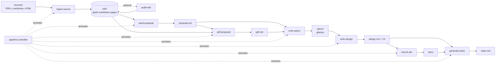

# KG-Seeded Intent-Driven Skills: Design Brief

**Audience:** LLM agent authoring an Agent Skills–compliant skill set.
**Status:** Draft for implementation.
**Reading order:** linear; every section either constrains an authoring decision or provides a referenceable artifact.

---

## 1. Purpose & Novel Contribution

This document specifies a set of Agent Skills that orchestrate a research-and-development pipeline running from raw-source ingestion to generated implementation tasks. The pipeline composes two existing patterns:

- **Karpathy's LLM Wiki pattern** — a stateful, LLM-maintained markdown knowledge base that compounds across sessions, replacing per-query RAG with persistent knowledge.
- **Intent-driven development** — the workflow `proposal → specs → design → adr → tasks`, where each artifact is explicit and the reasoning behind the work is preserved.

**The novel contribution lives in the seam between them.** The wiki, treated as a knowledge graph (KG) over its typed pages, **seeds the `proposal` and `grill-me` stages** of the intent-driven workflow. Where the KG contains high-confidence claims, the pipeline may **automate decisions that would normally require human input**. Where confidence is low, the system surfaces the gap rather than guessing — converting low-confidence regions of the KG into challenges during proposal interrogation.

You will author:

- Nine `SKILL.md` files (one per skill, agentskills.io–compliant)
- A canonical Python package providing deterministic modules
- Seven markdown templates and one YAML config
- Golden-file tests per module and fixture-based evals per LLM-shaped skill

The deliverable is portable across any Agent Skills–compliant runtime. **opencode + OpenSpec** are referenced as the tested-against implementation but are not required.

---

## 2. Pipeline Diagram



State transfer is by on-disk artifact; the controller defines sequence and decision points but does not pass values in memory.

---

## 3. Architecture

### 3.1 Wiki as Knowledge Graph

The wiki is the only persistent representation of the KG. There is no derived graph database. Queries are performed by a Python traversal library that parses wiki files on demand.

**Storage**
- Directory: `wiki/`
- All files are markdown with YAML frontmatter.
- File naming: kebab-case, type-prefixed. Examples: `entity-llm-wiki.md`, `claim-rag-rediscovers-knowledge.md`, `source-karpathy-2026.md`, `question-when-does-confidence-decay.md`.

**Page types (nodes)**

| `type` | Role | Carries confidence? |
|---|---|---|
| `entity` | A thing referenced by claims (concept, person, system, technique). | No |
| `claim` | An assertion. The unit of evidence. | **Yes** |
| `source` | A raw input (paper, article, document) registered when ingested. | No |
| `question` | An unresolved or grill-worthy open question. | No |

Every page MUST set `type` in frontmatter.

**Edges**

Edges are wiki-links inside page bodies. The edge kind is encoded in the link alias slot:

```
[[claim-x-causes-y | supports]]
[[claim-rag-stateless | contradicts]]
[[entity-llm-wiki]]            # default: mentions
```

Canonical edge kinds: `mentions` (default), `supports`, `contradicts`, `refines`. The traversal library treats unknown aliases as `mentions`.

**Frontmatter conventions**

Common fields on every page:

```yaml
---
type: claim
id: claim-rag-rediscovers-knowledge
title: "RAG rediscovers knowledge on every query"
created: 2026-05-25
sources:
  - source-karpathy-2026
---
```

Claim pages additionally carry the `confidence` block defined in §3.2.

### 3.2 Confidence Model

Confidence is **per-claim canonical**, recorded in the Claim page's frontmatter. Page-level and edge-level confidence are computed on demand by rolling up the claims involved.

**Base score**

A single LLM rating in `[0, 1]` recorded by `ingest-source` when a claim is first added. This value is never edited after creation.

**Augmentation (deterministic, applied by `kg_pipeline.confidence`)**

A single LLM rating is poorly calibrated and ignores accumulation — which is the central insight of the wiki pattern. Two cheap, pure-Python signals are layered on top:

1. **Source-count multiplier.** A claim cited by `n` distinct Source pages is multiplied by:
   ```
   multiplier(n) = min(1.10, 1.00 + 0.04 * (n - 1))
   ```
   Caps at +10%. Configurable in `config.yaml` under `confidence.source_count_curve`.

2. **Contradiction cap (floor).** If the claim has any `contradicts` edge (incoming or outgoing), its effective score is clamped at most to a configurable floor (`config.yaml: confidence.contradiction_floor`, default `0.40`). The cap fires regardless of multiplier output.

**Effective score**

```
multiplied = base * multiplier(source_count)
effective  = min(contradiction_floor, multiplied) if contradicted else multiplied
```

**Frontmatter shape**

```yaml
confidence:
  base: 0.78           # LLM at ingest; never edited after creation
  source_count: 3      # derived from `sources:` length
  contradicted: false  # derived from incoming/outgoing contradicts edges
  effective: 0.842     # computed by kg_pipeline.confidence.recompute
```

`effective` is always the recomputed value. The agent never edits it by hand; it runs the deterministic recompute when source counts or contradiction edges change. Recompute is **idempotent**.

**Rollups**
- Page confidence (for non-Claim pages that aggregate claims) = `min(effective)` over claims on the page. The most conservative rollup.
- Edge confidence = `min(effective)` over endpoint claims.

The `min` choice is intentional: a chain of reasoning is no stronger than its weakest link. Documented and configurable as `confidence.rollup: min | mean | max` (default `min`).

### 3.3 Seeding Mechanism

#### 3.3.1 KG → Proposal

`seed-proposal` queries the wiki and emits a proposal artifact pre-populated with KG-sourced subsections. Each subsection cites the wiki claims it draws from using inline wiki-links plus the claim's `effective` value.

Four layers, produced together:

1. **`context-from-kg`** — high-confidence claims relevant to the topic, fetched by entity-neighborhood traversal. Threshold: `thresholds.proposal_seed_min` (default `0.70`).
2. **`prior-art-from-kg`** — claims with a Source page of `kind: publication`, surfacing related work to ground in. Floor relaxed (default `0.60`) to broaden the prior-art set.
3. **`candidate-problems`** — *gaps, contradictions, and low-confidence regions* in the KG presented as candidate problem statements. **This is the most novel layer:** it inverts the usual flow where a human supplies the problem.
4. **`constraints-from-kg`** — claims tagged `kind: constraint` in frontmatter, or at the end of a `refines` chain from a constraints-root entity. These bound the design space.

The agent's authoring layer is added on top of the KG-sourced subsections; provenance links are preserved.

#### 3.3.2 KG → Grill-Me

`grill-proposal` reads a proposal and emits `grill.md` with four sections, each interrogating the proposal against the KG. Each entry cites the wiki page(s) it draws from with `effective` shown inline.

1. **Open questions** — Question pages in the wiki related to the proposal's topic, plus LLM-generated questions seeded by gaps the proposal does not address.
2. **Counter-claims** — wiki claims with `effective >= thresholds.grill_dismiss_min` that contradict or stand in tension with proposal assertions (LLM judgment).
3. **Hidden-assumption challenges** — the most consequential category. For every proposal assertion, the skill identifies wiki claims the proposal implicitly relies on and **surfaces low-confidence dependencies**. A proposal that depends on a claim at `0.42` must explicitly address that fragility before advancing.
4. **Failure-pattern warnings** — patterns from prior Source pages tagged `kind: post-mortem` or similar, relevant to the topic. May be empty.

The proposal cannot advance until every entry in `grill.md` is addressed.

### 3.4 Automation Thresholds & Human-in-Loop Modes

All thresholds and modes live in `references/config.yaml`:

```yaml
confidence:
  source_count_curve: [1.00, 0.04, 1.10]   # base, step, cap
  contradiction_floor: 0.40
  rollup: min                              # min | mean | max

thresholds:
  proposal_seed_min: 0.70
  prior_art_floor: 0.60
  grill_dismiss_min: 0.85
  adr_auto_record_min: 0.90
  low_confidence_floor: 0.40

audit:
  staleness_days: 14

modes:
  ingest_source: autonomous
  audit_wiki: autonomous
  seed_proposal: autonomous
  grill_proposal: autonomous
  write_specs: autonomous
  write_design: pause_and_ask
  record_adr: pause_and_ask
  generate_tasks: autonomous
```

**Mode semantics (per skill)**

- `autonomous` — at a low-confidence branch, the skill picks the safest default and writes an entry to `proposals/<change-id>/decisions-log.md` citing the wiki claims involved and the threshold that fired. Pipeline continues.
- `pause_and_ask` — at a low-confidence branch, the skill emits `question-for-operator.md` and halts. The controller does not proceed until the artifact is resolved (file deleted or marked answered in frontmatter).

Defaults above are conservative: the stages nearest durable architectural commitments (`write_design`, `record_adr`) default to `pause_and_ask`. Ingestion and seeding default to `autonomous` because their output is easily revisable.

---

## 4. Constraints & Non-Goals

**Constraints**
- Generic Agent Skills runtime. Do not depend on opencode-specific features, MCP servers, Claude Code specifics, or any SaaS.
- No external services, no graph database, no paid APIs.
- Python is canonical for deterministic modules. Standard library plus the minimum pure-Python packages (`pyyaml`, optionally `networkx` for traversal helpers). No TypeScript twin.
- Templates are intentionally lightweight. Gherkin is markdown with `Feature:`/`Scenario:`/`Given/When/Then` conventions — not a parsed format. ADRs follow MADR/Nygard style. C4 is mermaid embedded in markdown. Tasks are markdown checklists with frontmatter.
- `SKILL.md` files MUST conform to agentskills.io: `name` (kebab-case, ≤64 chars, matches directory), `description` (≤1024 chars, says what + when), optional `compatibility` and `metadata`. Keep each `SKILL.md` under 500 lines; push examples to a sibling `references/` directory inside the skill if needed.

**Non-goals**
- No code generation or execution beyond `tasks.md`. The pipeline ends at task emission.
- No verification, test running, or CI integration.
- Not a clone of OpenSpec, superpowers, or any referenced repo. Implement only the minimum primitives needed for the workflow.
- No graph DB, no vector store, no embeddings.
- No multi-user collaboration semantics.

---

## 5. File Layout

```
/
├── .agents/skills/
│   ├── pipeline-controller/SKILL.md
│   ├── ingest-source/SKILL.md
│   ├── audit-wiki/SKILL.md
│   ├── seed-proposal/SKILL.md
│   ├── grill-proposal/SKILL.md
│   ├── write-specs/SKILL.md
│   ├── write-design/SKILL.md
│   ├── record-adr/SKILL.md
│   └── generate-tasks/SKILL.md
├── kg_pipeline/                  # canonical Python package
│   ├── __init__.py
│   ├── wiki/                     # traversal, parsing, page typing
│   ├── confidence/               # rating I/O, rollup, multiplier/cap
│   ├── templates/                # renderers
│   ├── validators/               # required-section, schema
│   └── paths/                    # file layout helpers
├── references/                   # templates (loaded on demand)
│   ├── proposal-template.md
│   ├── gherkin-spec-template.md
│   ├── adr-template.md
│   ├── c4-template.md
│   ├── tasks-template.md
│   ├── wiki-page-template.md
│   ├── grill-template.md
│   └── config.yaml
├── sources/                      # raw inputs (PDF, md, HTML)
├── wiki/                         # the knowledge graph
├── proposals/                    # one subdir per change
│   └── <change-id>/
│       ├── proposal.md
│       ├── grill.md
│       ├── decisions-log.md      # autonomous-mode entries
│       ├── specs/
│       ├── design.md
│       ├── adrs/
│       └── tasks.md
└── tests/
    ├── modules/                  # golden-file tests
    └── skills/                   # fixture-based evals
```

`<change-id>` is a kebab-case slug generated by the controller (e.g. `2026-05-25-rag-replacement`).

---

## 6. Skill Inventory

| # | Skill | Description seed (engineered for activation) | Inputs | Outputs | Mode key |
|---|---|---|---|---|---|
| 1 | `pipeline-controller` | Orchestrates the research-to-tasks pipeline: ingest sources, build wiki, seed proposal, grill, write specs/design/ADR, generate tasks. Activate when the user asks to run the pipeline end-to-end or initialize a new change. | user intent, `config.yaml` | `proposals/<change-id>/` skeleton, `decisions-log.md` | — |
| 2 | `ingest-source` | Ingests a single raw source (PDF, markdown, HTML) into the wiki, creating Entity/Claim/Source/Question pages with LLM-rated confidence and inline neighbor contradiction checks. | source file path | new/updated `wiki/*.md` | `ingest_source` |
| 3 | `audit-wiki` | Periodic full-wiki sweep for cross-page contradictions, missed cross-references, and stale rollups. Optional. | `wiki/` | updates to `wiki/`, `audit-report.md` | `audit_wiki` |
| 4 | `seed-proposal` | Queries the wiki and emits a proposal pre-populated with context-from-kg, prior-art-from-kg, candidate-problems, and constraints-from-kg, each citing wiki claims. | change-id, optional topic hint | `proposals/<change-id>/proposal.md` | `seed_proposal` |
| 5 | `grill-proposal` | Reads a proposal and emits a `grill.md` with questions, counter-claims, hidden-assumption challenges, and failure-pattern warnings, sourced from the wiki. | `proposal.md`, `wiki/` | `grill.md` | `grill_proposal` |
| 6 | `write-specs` | Translates an accepted proposal and grill responses into gherkin-style scenarios. | `proposal.md`, `grill.md` | `specs/*.md` | `write_specs` |
| 7 | `write-design` | Produces a design document with C4-in-mermaid diagrams from the specs. | `specs/` | `design.md` | `write_design` |
| 8 | `record-adr` | Extracts durable architectural decisions from the design into ADR files. | `design.md` | `adrs/*.md` | `record_adr` |
| 9 | `generate-tasks` | Produces `tasks.md` — a markdown checklist with frontmatter — from `design.md` and the ADRs. | `design.md`, `adrs/` | `tasks.md` | `generate_tasks` |

---

## 7. Per-Skill Detailed Specifications

For each skill, author a `SKILL.md` with the frontmatter shown and a body covering: behavior summary, inputs, outputs, decision rules, low-confidence handling. Keep each `SKILL.md` under 500 lines.

### 7.1 `pipeline-controller`

```yaml
---
name: pipeline-controller
description: Orchestrates the KG-seeded research-to-tasks pipeline. Activate when the user asks to "run the pipeline", "start a new change", or "go from sources to tasks". Reads config.yaml and walks ingest → wiki → seed-proposal → grill-proposal → write-specs → write-design → record-adr → generate-tasks, activating the appropriate child skill at each stage and respecting per-stage thresholds and modes.
metadata:
  stage: orchestration
  version: "1.0"
---
```

**Behavior**
1. Resolve or generate `<change-id>`; create `proposals/<change-id>/`.
2. Read `references/config.yaml`. Surface unrecognized keys.
3. For each stage in order, activate the corresponding child skill. After each stage, validate the produced artifact via `kg_pipeline.validators`.
4. On a low-confidence branch in any skill, respect that skill's mode key.
5. Maintain `proposals/<change-id>/decisions-log.md` capturing every autonomous low-confidence pick, with wiki-claim citations and the threshold that fired.

**Decision rules**
- If `audit-wiki` mode is `autonomous` and the wiki has not been audited within `audit.staleness_days`, activate `audit-wiki` between ingest and seed-proposal.
- Never advance past a stage whose artifact fails validation.

### 7.2 `ingest-source`

```yaml
---
name: ingest-source
description: Ingests a single raw source (PDF, markdown, HTML) into the KG wiki. Creates Source/Entity/Claim/Question pages with LLM-rated base confidence, runs inline contradiction checks against immediate wiki neighbors, and records all derived edges. Activate when adding a new document to the knowledge base.
---
```

**Inputs**
- A single path to a raw source under `sources/`.

**Outputs**
- A `wiki/source-<slug>.md` page registering the source.
- Zero or more new `wiki/entity-*.md`, `wiki/claim-*.md`, `wiki/question-*.md` pages.
- Updates to existing pages (added links, added sources to claim frontmatter).

**Decision rules**
- If a candidate claim closely matches an existing Claim page (LLM judgment + `confidence/dedupe.py` token-similarity threshold), update the existing page rather than creating a duplicate. Add the new source to its `sources:` list.
- On a detected contradiction with an immediate neighbor, add a `contradicts` edge in both directions. Do **not** rewrite the older claim.
- Set the base confidence of every new claim. Source-count and contradiction effects are computed by `kg_pipeline.confidence.recompute` — never set `effective` directly.

**Low-confidence handling**
- `autonomous` (default): create the page with the LLM-estimated base score. Pipeline continues.
- `pause_and_ask`: emit `question-for-operator.md` if base confidence is below `thresholds.low_confidence_floor`.

### 7.3 `audit-wiki`

```yaml
---
name: audit-wiki
description: Performs a full-wiki sweep for cross-page contradictions, missed cross-references, stale confidence rollups, and orphan pages. Optional; run periodically or when ingest-source has been called many times since the last audit.
---
```

**Behavior**
- Run `kg_pipeline.confidence.recompute_all`.
- For each Claim, batch-scan all other Claims for semantic contradiction (LLM judgment).
- Emit `audit-report.md` summarizing changes.

**Decision rules**
- Add new `contradicts` edges only between Claim pages.
- Do not delete pages, even if orphaned. Flag orphans in the report.

### 7.4 `seed-proposal`

```yaml
---
name: seed-proposal
description: Generates a proposal artifact pre-populated from the KG. Produces four subsections — context-from-kg, prior-art-from-kg, candidate-problems, constraints-from-kg — each citing the wiki claims it draws from. Activate when starting a new change, optionally with a topic hint.
---
```

**Inputs**
- `<change-id>` (controller-generated)
- Optional topic hint (a string or an Entity page id)

**Outputs**
- `proposals/<change-id>/proposal.md` populated from `references/proposal-template.md`

**Decision rules — by subsection**
- `context-from-kg`: claims whose `effective >= thresholds.proposal_seed_min` AND within 2 hops of the topic entity in the wiki link graph.
- `prior-art-from-kg`: claims sourced from at least one Source page tagged `kind: publication`. Lower floor (`thresholds.prior_art_floor`) accepted to broaden the set.
- `candidate-problems`: (i) low-confidence claims `effective < thresholds.low_confidence_floor`, (ii) claims with active `contradicts` edges, (iii) Question pages within 2 hops of the topic.
- `constraints-from-kg`: claims with `kind: constraint` frontmatter, or claims at the end of a `refines` chain from a constraints-root entity.

**Low-confidence handling**
- `autonomous`: if no claims pass the threshold for a subsection, emit it empty with a clear note (`_KG provided no high-confidence content for this subsection._`). Continue.
- `pause_and_ask`: emit `question-for-operator.md` asking for a tighter topic hint.

### 7.5 `grill-proposal`

```yaml
---
name: grill-proposal
description: Interrogates a proposal against the KG, producing grill.md with four sections — open questions, counter-claims, hidden-assumption challenges, failure-pattern warnings. Each entry cites the wiki page(s) and effective confidence it draws from. The proposal cannot advance until grill.md is addressed.
---
```

**Inputs**
- `proposals/<change-id>/proposal.md`
- The entire wiki for query

**Outputs**
- `proposals/<change-id>/grill.md` populated from `references/grill-template.md`

**Decision rules**
- **Counter-claims:** include wiki claims with `effective >= thresholds.grill_dismiss_min` that contradict proposal assertions (LLM judgment).
- **Hidden-assumption challenges:** for every proposal assertion, identify wiki claims it implicitly relies on (LLM extraction). For each such claim with `effective < thresholds.grill_dismiss_min`, add an entry citing the claim and its `effective`. **This is the highest-leverage category.**
- **Open questions:** Question pages within 2 hops of the topic entity, plus LLM-generated questions seeded by gaps the proposal does not address.
- **Failure-pattern warnings:** populated only if Source pages tagged `kind: post-mortem` exist relevant to the topic. May be empty.

**Low-confidence handling**
- `autonomous`: dismiss a candidate challenge only if its supporting wiki claim has `effective < thresholds.grill_dismiss_min` AND no contradiction edge exists. Otherwise include it.
- `pause_and_ask`: when in doubt, include and flag.

### 7.6 `write-specs`

```yaml
---
name: write-specs
description: Translates an accepted proposal and the proposer's grill responses into gherkin-style scenarios (Feature/Scenario/Given/When/Then) in markdown. Lightweight — no parser, just convention. Activate after grill.md is resolved.
---
```

**Decision rules**
- Refuse to run if `grill.md` contains unaddressed entries (entry frontmatter `addressed: true` is required on every entry).
- Each grill entry that became a requirement is traceable to a Scenario via `<!-- traces-grill: <entry-id> -->` HTML comment.

### 7.7 `write-design`

```yaml
---
name: write-design
description: Produces design.md from gherkin specs, including C4 diagrams as mermaid code blocks. Captures implementation approach, trade-offs, and component boundaries.
---
```

**Decision rules**
- At least one mermaid `C4Container` (or text equivalent) is required.
- Default mode: `pause_and_ask`. Design decisions create downstream commitments — surface them.

### 7.8 `record-adr`

```yaml
---
name: record-adr
description: Extracts durable architectural decisions from design.md into individual ADR markdown files (MADR/Nygard style). Activate after design.md stabilizes.
---
```

**Decision rules**
- One ADR per decision; never combine.
- If a decision's inherited confidence (from design assertions and the wiki claims they cite) `>= thresholds.adr_auto_record_min`, record without prompting. Otherwise, in `pause_and_ask` mode, ask.

### 7.9 `generate-tasks`

```yaml
---
name: generate-tasks
description: Produces tasks.md — a markdown checklist with frontmatter — from design.md and the ADRs. Final stage of the pipeline; no execution follows.
---
```

**Decision rules**
- Each task references the spec scenario(s) it satisfies via `<!-- traces-spec: <scenario-id> -->`.
- Group tasks by ADR where applicable.

---

## 8. Python Module API Contracts

The canonical Python package is `kg_pipeline/`. Modules are pure-Python; dependencies limited to stdlib plus `pyyaml` (and optionally `networkx`). Every public function has a docstring and a golden-file test. **All deterministic operations are idempotent.**

### 8.1 `kg_pipeline.wiki`

```python
def load_page(path: Path) -> Page: ...
def list_pages(wiki_dir: Path, type: Optional[str] = None) -> list[Page]: ...
def parse_links(body: str) -> list[Link]: ...                       # Link(target, kind)
def neighbors(page: Page, wiki_dir: Path, hops: int = 1) -> list[Page]: ...
def write_page(page: Page) -> None: ...
```

`Page` is a dataclass with `frontmatter: dict` and `body: str`. `Link` is `(target_id: str, kind: str)`.

### 8.2 `kg_pipeline.confidence`

```python
def recompute(claim_page: Page, wiki_dir: Path, config: dict) -> Page: ...
def recompute_all(wiki_dir: Path, config: dict) -> int: ...         # returns count updated
def rollup_page(page: Page, wiki_dir: Path, config: dict) -> float: ...
def rollup_edge(link: Link, wiki_dir: Path, config: dict) -> float: ...
```

### 8.3 `kg_pipeline.templates`

```python
def render(template_name: str, **vars) -> str: ...
def render_to_file(template_name: str, out_path: Path, **vars) -> None: ...
```

Templates load from `references/`. Variable substitution uses `str.format_map` against a flat dict — no Jinja, no external template engine.

### 8.4 `kg_pipeline.validators`

```python
def validate_skill_md(path: Path) -> list[str]: ...                 # returns errors (empty = pass)
def validate_proposal(path: Path) -> list[str]: ...
def validate_grill(path: Path) -> list[str]: ...
def validate_specs(specs_dir: Path) -> list[str]: ...
def validate_design(path: Path) -> list[str]: ...
def validate_adrs(adrs_dir: Path) -> list[str]: ...
def validate_tasks(path: Path) -> list[str]: ...
```

Each returns a list of human-readable errors. The controller refuses to advance past a stage with errors.

### 8.5 `kg_pipeline.paths`

```python
def change_dir(change_id: str) -> Path: ...
def proposal_path(change_id: str) -> Path: ...
def grill_path(change_id: str) -> Path: ...
def specs_dir(change_id: str) -> Path: ...
def design_path(change_id: str) -> Path: ...
def adrs_dir(change_id: str) -> Path: ...
def tasks_path(change_id: str) -> Path: ...
def wiki_dir() -> Path: ...
def sources_dir() -> Path: ...
def config_path() -> Path: ...
```

Centralizes layout. Skills MUST use these helpers rather than hard-coding paths.

---

## 9. Templates

All templates live in `references/`. Renderers use `str.format_map`; placeholders are `{name}`.

- `proposal-template.md` — frontmatter with `change-id`, `topic`, `created`; sections `# Why`, `## Context (from KG)`, `## Prior Art (from KG)`, `## Candidate Problems`, `## Constraints (from KG)`, `## Proposed Change`, `## Open Questions`.
- `grill-template.md` — sections `## Open Questions`, `## Counter-Claims`, `## Hidden-Assumption Challenges`, `## Failure-Pattern Warnings`, plus `## Responses` that the proposer fills in. Each entry has frontmatter `id` and `addressed: false`.
- `gherkin-spec-template.md` — `# Feature`, `## Scenario`, `Given/When/Then` blocks.
- `adr-template.md` — MADR-style: `# ADR <num>: <title>`, `## Status`, `## Context`, `## Decision`, `## Consequences`, `## Sources`.
- `c4-template.md` — mermaid `C4Context`, `C4Container` examples and headings.
- `tasks-template.md` — `# Tasks`, grouped checklist with `<!-- traces-spec -->` and `<!-- traces-adr -->` comments.
- `wiki-page-template.md` — frontmatter scaffolds per `type`.
- `config.yaml` — confidence weights, thresholds, audit policy, modes (see §3.4).

Keep templates short. They constrain structure, not prose.

---

## 10. Tests & Evals

### 10.1 Module tests (golden-file)

Each `kg_pipeline.*` module has `tests/modules/test_<module>.py`. Tests use fixture wikis under `tests/fixtures/wiki-<n>/` and compare actual vs. expected JSON dumps of pages, links, and rollups. No mocks; the wiki is the input.

### 10.2 Skill evals (fixture-based)

Each LLM-shaped skill has an eval under `tests/skills/<skill-name>/`:

- A `sources/` fixture (1–3 small files)
- The expected wiki state after running the upstream skills
- For `seed-proposal` and `grill-proposal`: a rubric (`rubric.md`) listing required and forbidden mentions in the output. Pass/fail is judged by an LLM call against the rubric.

Evals are not run automatically by the pipeline. The operator runs them when changing a `SKILL.md` body.

---

## 11. Appendix: Walkthrough on a Fixture

A tiny worked example. Use it as the smoke test for an end-to-end run.

**Input:** `sources/karpathy-2026.md` — a short note describing the LLM wiki pattern.

**After `ingest-source`:**

```
wiki/
├── source-karpathy-2026.md
├── entity-llm-wiki.md
├── claim-rag-rediscovers-knowledge-on-every-query.md   (base 0.85, n=1, effective 0.85)
├── claim-llm-maintains-wiki-stateful.md                (base 0.82, n=1, effective 0.82)
└── question-when-does-the-wiki-drift.md
```

**After `seed-proposal`** for topic `entity-llm-wiki`:

```markdown
# Why
…

## Context (from KG)
- [[claim-rag-rediscovers-knowledge-on-every-query | supports]] (effective 0.85)
- [[claim-llm-maintains-wiki-stateful | supports]] (effective 0.82)

## Prior Art (from KG)
- Source: [[source-karpathy-2026]]

## Candidate Problems
- Open question: [[question-when-does-the-wiki-drift]]

## Constraints (from KG)
_KG provided no high-confidence content for this subsection._
```

**After `grill-proposal`:**

```markdown
## Hidden-Assumption Challenges
_None — only one source; no low-confidence dependencies surfaced._

## Open Questions
- [[question-when-does-the-wiki-drift]]
```

A second source citing the same two claims would raise both `effective` values via the source-count multiplier (`n=2 → ×1.04`). That is the smallest end-to-end demonstration of accumulation through confidence.

---

**End of brief.** Author the skill set in this order: templates → Python modules → child `SKILL.md` files → controller `SKILL.md` → tests/evals. The controller is authored last because its description references all the others.
