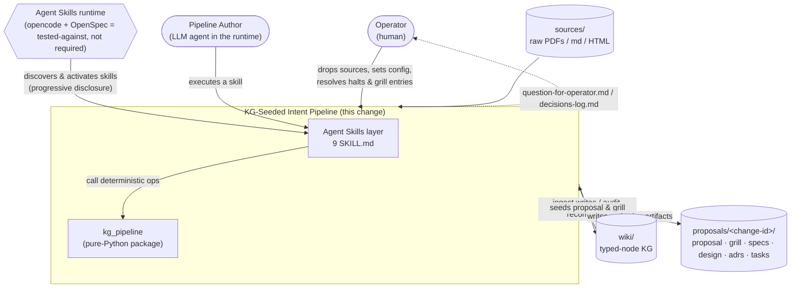
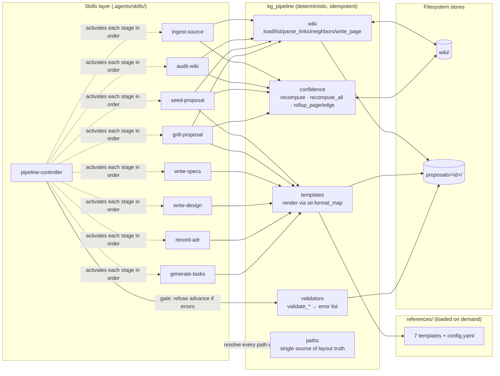

# Design

## Overview

The deliverable is a single in-process system with two cooperating layers:
**LLM-shaped skills** (`SKILL.md` files under `.agents/skills/`) that carry
judgment, and a **deterministic Python package** (`kg_pipeline/`) that carries
everything reproducible. The dividing line is the spine of the design: any
operation whose output must be byte-stable and testable lives in the package;
any operation requiring an LLM's reading of a source or a proposal lives in a
skill. The skills hold no derived state of their own — they call the package
and read/write files. This split is what lets the system honor both
*portability* (ASR-1: no runtime-specific code) and *determinism* (ASR-2: the
package is pure-Python, idempotent, golden-tested) at once.

The novel seam — wiki-as-knowledge-graph seeding the proposal and grill stages
— is realized without any graph database. The wiki *is* the KG: typed markdown
pages (`entity`/`claim`/`source`/`question`) whose edges are wiki-links with
the kind encoded in the alias slot. `kg_pipeline.wiki` parses these on demand;
`kg_pipeline.confidence` turns each claim's stored LLM `base` score into an
`effective` score through a pure-Python source-count multiplier and a
contradiction floor. That `effective` value is the deterministic gate
(ASR-4): `seed-proposal` includes only claims at or above a threshold,
`grill-proposal` raises a challenge for every implicitly-relied-upon claim
below one, and the per-stage `autonomous`/`pause_and_ask` mode decides whether
a low-confidence branch is logged and auto-resolved or halts for a human.

State moves only through files (ASR-3). The `pipeline-controller` skill
sequences the stages, but passes nothing in memory: each stage reads the prior
stage's artifact off disk, writes its own, and the controller calls the
matching `kg_pipeline.validators` function and **refuses to advance** while the
returned error list is non-empty (ASR-5). The produced change lives under a
flat `proposals/<change-id>/` tree whose paths are centralized in
`kg_pipeline.paths`, deliberately *not* OpenSpec's `openspec/changes/` +
`development/manifests/` shape — portability forbids coupling the produced
artifacts to OpenSpec's directory contract (opencode + OpenSpec are
tested-against, not required).

Because this is the **first change in the repository to author ADRs**, there
are no in-force decisions to honor or override; every decision below is
net-new. The design's job here is to make the brief's choices explicit and
testable, confirm the brief's confidence configuration as the committed
default rather than re-deriving it, and resolve the two design-stage open
questions the proposal promoted (produced-pipeline layout; confidence
defaults).

## Context Diagram (C4 L1)

Plain Mermaid (not C4-specific syntax), per the design-stage convention. One
bounded context, one process; the diagram shows who and what the system
touches at its edges.

## Component Diagram (C4 L3)

The change spans one bounded context and never crosses a process boundary, so
no L2 container diagram is drawn (per the smallest-useful-set rule); the
container grouping is folded into this component view as subgraphs. It shows
the skill→module→store call structure that the specs constrain.

## In-Force ADR Treatment

**No in-force ADRs.** Per the design manifest's slice 5, the supersession
walk over `wiki/decisions/` and `openspec/archive/` found zero ADRs — both
directories are absent and no ADR has shipped in this repository. The walk
completes trivially (no nodes, no `Supersedes:` chains, no orphans), so the
design gate is satisfied and there is nothing to honor, override, or mark
not-applicable. This is the first change to author ADRs; every decision in
*Decisions Distilled to ADRs* below is net-new and will carry no
`Supersedes:` line.

## Architecturally Significant Requirements

The design must meet the nine ASRs derived in the design manifest's slice 6
(no dedicated QAS pages exist in the wiki; these are distilled from the
specs' Acceptance Criteria and the brief's §4 constraints). In force here:

- **ASR-1 Portability** — satisfied by the skill/package split and by the
  `proposals/<change-id>/` layout decision (no OpenSpec coupling).
- **ASR-2 Determinism & idempotency** — satisfied by confining all
  reproducible work to `kg_pipeline` with golden-file tests; `write_page`,
  `recompute`, `recompute_all`, and template render are idempotent.
- **ASR-3 On-disk-only state transfer** — satisfied by the controller
  passing no in-memory values; stages communicate via files.
- **ASR-4 Confidence as automation gate** — satisfied by the per-claim
  `effective` model and the per-stage modes.
- **ASR-5 Validation gating** — satisfied by the controller calling
  `kg_pipeline.validators` and refusing to advance on a non-empty error list.
- **ASR-6 Progressive-disclosure skill budget** — satisfied by the 500-line
  cap, agentskills.io-compliant frontmatter, and `references/` for examples.
- **ASR-7 Provenance / traceability** — satisfied by inline `effective`
  citations and `traces-grill` / `traces-spec` comments.
- **ASR-8 Non-destructive wiki** — satisfied by dedupe-in-place, append-only
  contradiction edges, and orphan-flag-not-delete.
- **ASR-9 Minimal dependency surface** — satisfied by stdlib + `pyyaml`,
  optional non-result-altering `networkx`, and `str.format_map` templating.

## Known Pitfalls Avoided

Each is a `## Risks & Pitfalls` bullet from a manifest-core slice-2 concept
(design manifest slice 8), with how this design avoids it.

- **Schema / frontmatter drift** ([[concepts/llm-wiki-pattern]],
  [[concepts/agent-schema-document]]) — the typed-node model makes `type`
  mandatory (an untyped page is invalid), the seven `references/` templates
  are the canonical shapes, and `validate_skill_md` rejects a `SKILL.md`
  whose `name` drifts from its directory.
- **Stale synthesis / contradiction blindness**
  ([[concepts/compounding-knowledge]], [[concepts/wiki-ingest]]) — `effective`
  is always recomputed (never hand-edited), the contradiction floor caps a
  contradicted claim regardless of source count, and the controller runs
  `audit-wiki`'s `recompute_all` when the wiki is older than
  `audit.staleness_days`.
- **False contradictions** ([[concepts/wiki-lint]]) — a `contradicts` edge is
  append-only and bidirectional; the older claim's text is **never**
  rewritten, and the floor is a cap not a deletion, leaving a human to
  adjudicate via `pause_and_ask`.
- **Over-normalization / page sprawl** ([[concepts/wiki-ingest]]) — the ingest
  dedupe step updates an existing claim's `sources` list rather than minting a
  near-duplicate page.
- **Filesystem as source of truth / silent breakage**
  ([[concepts/artifact-dependency-graph]]) — stage advance is gated on
  `validators`, and `audit-wiki` flags orphans without deleting them, so a
  missing artifact surfaces as a validation error rather than a silent gap.
- **Vague / overly-broad skill descriptions**
  ([[concepts/progressive-disclosure]]) — each skill's `description` is
  engineered to state both *what* and *when to activate*, bounded by
  `validate_skill_md`.
- **SKILL.md / template bloat** ([[concepts/readable-skill]],
  [[concepts/custom-workflow-schema]]) — the 500-line cap plus
  examples-in-`references/` keeps activation cost low; templates constrain
  structure, not prose.
- **Implementation leakage in Gherkin** ([[concepts/gherkin]]) — the
  gherkin-spec template and `write-specs` enforce one observable `When` and an
  observable `Then`, keeping UI/DB mechanics out of scenarios.
- **Conflating / drift between spec and ADR**
  ([[concepts/spec-adr-dual-representation]]) — `record-adr` writes one ADR per
  decision and never combines decisions; ADRs are immutable and superseded,
  never edited.
- **Top-level `adr/` collisions** ([[concepts/intent-driven-schema]]) — the
  produced ADRs live under `proposals/<change-id>/adrs/`, scoped to the
  change, avoiding a split decision log.
- **No runtime validation of skills** ([[concepts/readable-skill]]) —
  golden-file module tests cover the deterministic package and rubric-judged
  fixture evals cover the LLM-shaped skills.

## Open Questions

- **Controller-gate enforceability (new, touches design).** ASR-5 requires
  the controller to *refuse to advance* past a failing stage, but
  `pipeline-controller` is itself an LLM `SKILL.md` and could in principle
  skip the `validators` call. The deterministic guarantee is that
  `kg_pipeline.validators` is pure Python returning an error list; the open
  question is whether a thin deterministic entrypoint (a `kg_pipeline` CLI the
  skill must shell out to) should *own* the gate, or whether the skill-eval
  rubric asserting the halt is sufficient assurance. Leaning toward the rubric
  for v1 (keeps the runtime generic per ASR-1), but flagged for
  `scientia-intent-adr` to settle as `adr-skill-vs-python-split`'s
  consequence.
- **Execution & ingest-back phases (promoted from proposal, not resolved by
  design).** The brief's loop ends at `tasks.md`; this design's controller
  stage-list is bounded accordingly and deliberately omits scientia's
  kanban-execution and ingest-synthesis phases. Whether "replace scientia" is
  total — requiring a portable design for those phases in a follow-up — is a
  product-scope decision, not a design one. Design proceeds on the bounded
  raw→tasks loop.
- **Rollup read-path during mid-edit (new, minor).** `rollup_page` /
  `rollup_edge` aggregate `effective` over a page's claims. Between an ingest
  that changes a claim and the next `recompute`, a stored `effective` is
  stale. The design assumes `audit-wiki`/`recompute_all` precede any rollup
  that gates seeding; the contract that "rollups read post-recompute values"
  is captured in `adr-effective-is-stored-derived`. Flagged in case a caller
  needs a recompute-on-read variant.
- **Cutover (out of design scope).** Whether and when a follow-up change
  physically removes the deprecated Hermes/OpenSpec-coupled bundle, and on
  what trigger, is a release decision — not resolved here.

## Decisions Distilled to ADRs

The following net-new architectural decisions will be captured as immutable
Y-statement ADRs by `scientia-intent-adr` (applying progressive rigor; each
is a distinct decision and must not be combined). Each names the ASR it
serves.

- **`adr-wiki-is-sole-kg-representation`** — The wiki is the only persistent
  KG representation; there is no derived graph database, and queries parse
  markdown on demand via `kg_pipeline.wiki`. *(ASR-1, ASR-9)*
- **`adr-edge-kind-in-link-alias`** — Edge kind is encoded in the wiki-link
  alias slot (`[[target | kind]]`), with unknown aliases defaulting to
  `mentions`. *(ASR-7)*
- **`adr-per-claim-quantitative-confidence`** — Confidence is per-claim and
  quantitative: `effective = min(contradiction_floor, base × multiplier)` when
  contradicted, else `base × multiplier`; this **confirms the brief's config
  defaults as committed** (`source_count_curve [1.00, 0.04, 1.10]`,
  `contradiction_floor 0.40`, `rollup min`, thresholds
  `proposal_seed_min 0.70` / `prior_art_floor 0.60` / `grill_dismiss_min 0.85`
  / `adr_auto_record_min 0.90` / `low_confidence_floor 0.40`,
  `audit.staleness_days 14`). Resolves proposal Open Question #4. *(ASR-4)*
- **`adr-effective-is-stored-derived`** — `effective` is persisted in claim
  frontmatter yet canonically derived: `recompute` is its only writer and is
  idempotent, and rollups read post-recompute values (freshness guaranteed by
  `recompute_all` + the staleness trigger). *(ASR-2, ASR-4)*
- **`adr-produced-layout-proposals-dir`** — The produced pipeline uses the
  brief's flat `proposals/<change-id>/` layout, centralized in
  `kg_pipeline.paths`, **not** OpenSpec's `openspec/changes/` +
  `development/manifests/` shape; portability forbids coupling produced
  artifacts to OpenSpec's directory contract. Resolves proposal Open
  Question #3. *(ASR-1)*
- **`adr-on-disk-state-transfer`** — The controller transfers no state in
  memory; every stage communicates solely through on-disk artifacts. *(ASR-3)*
- **`adr-skill-vs-python-split`** — LLM judgment lives in `SKILL.md`;
  deterministic, idempotent, testable operations live in `kg_pipeline`; the
  validator error-list is the deterministic guardrail the controller calls
  before advancing. *(ASR-2, ASR-5, ASR-6)*
- **`adr-templates-format-map-no-jinja`** — Templates render by
  `str.format_map` over a flat dict; no Jinja or external template engine.
  *(ASR-9)*
- **`adr-non-destructive-wiki`** — `ingest-source` dedupes in place,
  contradictions append a bidirectional edge leaving the older claim intact,
  and `audit-wiki` flags orphans without deleting; no skill deletes a page.
  *(ASR-8)*
- **`adr-conservative-human-in-loop-modes`** — Per-stage `autonomous` /
  `pause_and_ask` modes, with the stages nearest durable commitments
  (`write_design`, `record_adr`) defaulting to `pause_and_ask`. *(ASR-4)*
