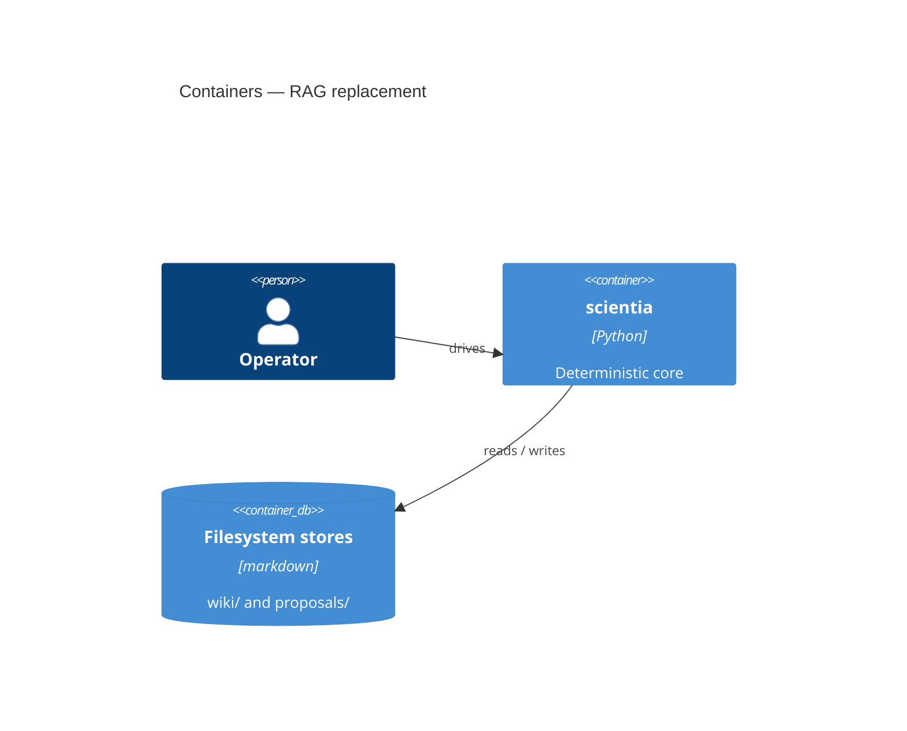

# Design: RAG replacement

## Overview

Replace the stateless RAG path with the stateful wiki + confidence model.

## Container Diagram (C4 L2)

## Component Map
- confidence: src/scientia/confidence.py, tests/modules/test_confidence.py
- wiki: src/scientia/wiki/**, tests/modules/test_wiki.py

## Shared Contracts
- confidence.EffectiveScore — owner: confidence — ratified-by: ADR-0004
